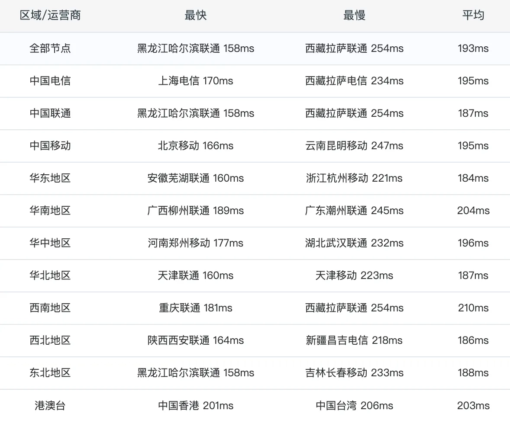
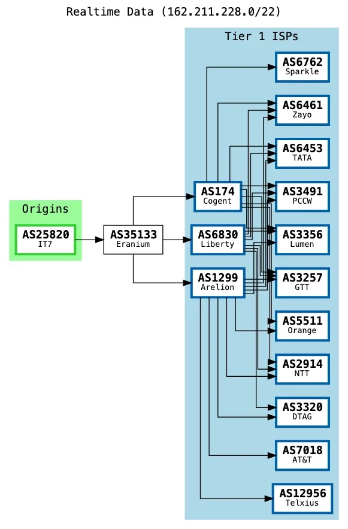
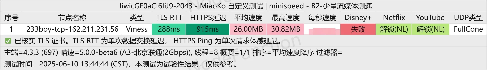
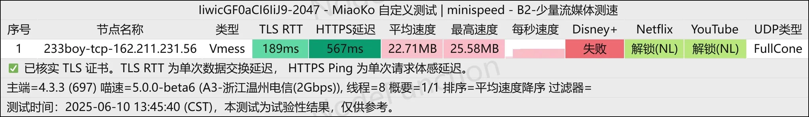
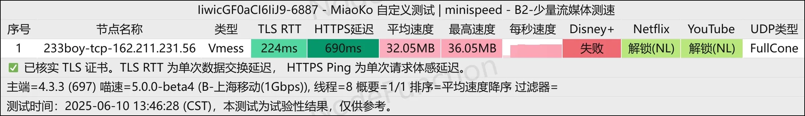
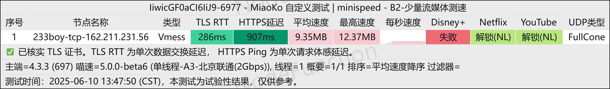
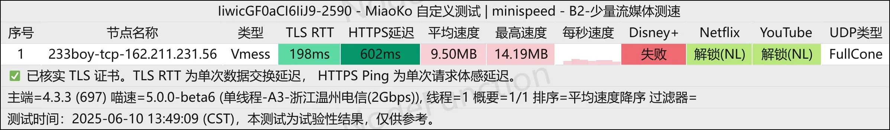

# BandwagonHost Amsterdam EUNL1: Triple-Network Optimized VPS at $37/Year

---

So BandwagonHost just rolled out a new datacenter, and honestly? It's pretty interesting. The Amsterdam EUNL1 triple-network optimized machine comes with a 30-day refund policy if you don't burn through more than 10% of your traffic. That's a nice safety net.

Right now, all three major Chinese networks route back through GIA. The other two networks haven't been optimized yet, but the official word is they're planning to upgrade China Unicom to 9929 and China Mobile to CMI routing. If that happens, this could get really good.

Here's what you're getting with **The Amsterdam Plan VPS**: 1 CPU core, 1GB RAM, 20GB SSD storage, and a generous 1TB monthly traffic allowance over a 2.5Gbps port. The yearly price sits at $39, but drops to $37 with the discount code **BWHCGLUKKB**.

---

## What's Actually Good (and What's Not)

The IP quality is... okay. Nothing spectacular. But here's the surprising part—BandwagonHost can actually unlock Netflix now. First time I've seen that happen with them.

All three networks currently route through GIA. If China Unicom gets that 9929 optimization, the experience will improve significantly. Right now, China Telecom and China Mobile users get the best performance.

One thing to note: the exit point is in the Netherlands, not Germany. So you'll see slightly higher latency than you might expect from a typical European server.

👉 If you're looking for a European VPS with solid connectivity to China and don't mind waiting for those routing optimizations, [BandwagonHost's Amsterdam datacenter offers surprisingly good value for triple-network optimization](https://bandwagonhost.com/aff.php?aff=79616).

---

## Performance Benchmarks

The system runs on an AMD EPYC-Genoa processor at 2.4GHz with KVM virtualization. Storage performance is solid—sequential writes hit 4.54GB/s and reads reach 4.35GB/s for 1MB blocks. That's more than enough for most workloads.

**Network Speed Tests:**
- Frankfurt: 4.7Gbps upload, 2.5Gbps download (7.86ms latency)
- Los Angeles: 466Mbps upload, 1.5Gbps download (153ms latency)
- Shanghai Unicom 5G: 495Mbps upload, 4.6Gbps download (153ms latency)

The multi-threaded tests from Chinese cities show decent speeds across the board. Beijing Unicom, Wenzhou Telecom, and Shanghai Mobile all performed reasonably well in both single and multi-threaded scenarios.

---

## Streaming and IP Quality

The streaming unlock situation is surprisingly good. Netflix works (identifying as US region), YouTube caches through Amsterdam servers, and most major platforms are accessible. The IP shows up as a datacenter/hosting IP, which is expected, but it's not heavily blacklisted.

Email ports are mostly open, though some services like Apple, ProtonMail, and a few others are blocked. Standard stuff for a budget VPS.

The routing tests confirm CN2 GIA paths for all three major Chinese carriers right now. China Telecom and China Mobile routes are clean through Frankfurt to Beijing/Guangzhou. China Unicom currently mixes CN2 GIA with 4837 backbone.

---

## Worth It?

For $37/year, this is a pretty solid deal if you need European hosting with optimized routes to China. The current GIA routing works well, and if they actually deliver on those promised optimizations for Unicom and Mobile, it'll be even better.

The 30-day money-back guarantee (as long as you stay under 10% traffic usage) takes most of the risk out. Just don't expect miracles from the IP quality—it's a hosting IP through and through. But for the price and the routing quality, especially once those upgrades land, this is one of the more interesting options in BandwagonHost's lineup right now.
